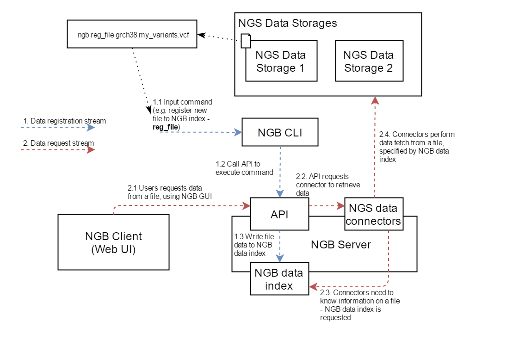
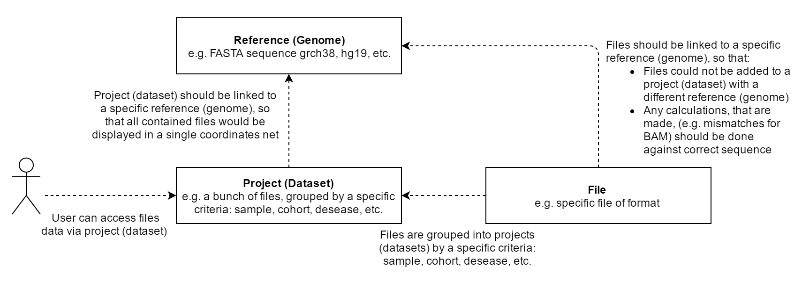
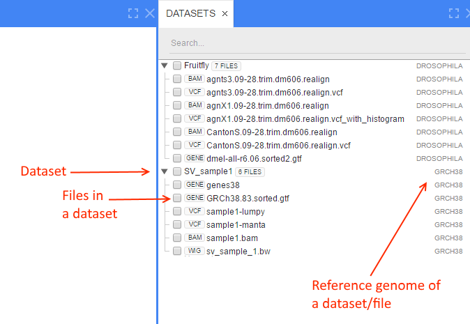
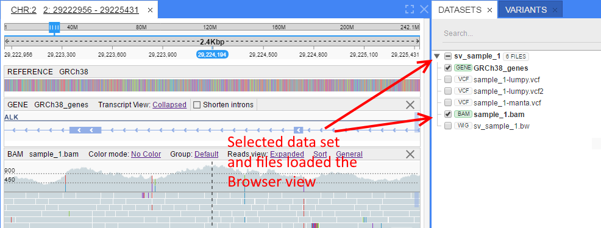

# Introduction
## Why NGB needs Command Line Interface?
New Genome Browser (NGB) is a client-server application, which provides a high performance NGS data access using a web-browser as a client.

"Client-server" means that client PC may not have (and usually doesn't have) an access to the NGS data files' those files are processed by a server.

To do this work, a server has to maintain an "index" of all the NGS files. This index is called NGB data index.

NGB data index is just a collection of metadata (files names, locations, some other properties). Files themselves (as well as their corresponding indicies) are located on external storages, that could be accessed by NFS/HTTP/FTP.

Adding an object to the NGB data index is called "registration".

NGB data index can be stored in two ways:
* for small installations - file storage is used
* for large-scale installations (requiring Network Load Balancing) - PostgreSQL database is used

There are two mechanisms to manage NGB data index:

### REST API
 NGB provides JSON REST API, that could be used by external systems (like a pipeline) to register files

* **Pros:**
  * Lowest level access - all APIs are available
  * Any kind of automation
* **Cons:**
  * Hard to use by a human or in a script
  * Needs deep knowledge of NGB architecture and dataflows

### NGB CLI
NGB provides Command Line Interface (CLI) that exposes all NGB data index manipulation operations

* **Pros:**
    * Easy to use by a human and script for registration of any amount of files
* **Cons:**
    * No cons - looks ideal for index maintaining

## Dataflow of files registration using CLI
Typical dataflow of registration using CLI and data access using GUI is shown on the diagram below.

1. Registration via CLI
    * (1.1) A command to register an object is issued (a file in this case - see reg_file command)
    * (1.2) NGB CLI performs specific calls to NGB REST API (one or several calls could be made according to a command)
    * (1.3) NGB REST API writes necessary data to NGB data index. Typically this data contains - file friendly name, used to display on GUI and file physical location.
Depending on the file type - additional operation could be performed, e.g. for feature files (like GFF/GTF) - features are indexed to provide gene search function on the GUI.
    * Now the registered file is available to NGB Web Client
2. Accessing data registered via CLI
    * (2.1) NGB Web Client issues request to retrieve data from a previously registered file
    * (2.2) This request is handled by NGB REST API, which asks NGS Data Connectors to load the requested data
    * (2.3) NGS Data Connectors search corresponding information in NGB data index (e.g. file path) which was added by NGB CLI
    * (2.4) Using the information obtained, NGS Data Connectors read data from external storage and return it to NGB Web Client

## NGB object model
NGB maintains an object model that is used and manipulated via CLI.
As shown on a diagram below, there are three main objects - *Reference, Dataset,* and *File.*

The relationships between Reference, Dataset, and File are also shown on the NGB Web Client GUI

### Datasets list
* User opens a homepage
* User select specific dataset, which contains data of interest

### Tracks view
* User views NGS files, that are added to a dataset

To make NGS files visible to a user, the following steps should be performed:
1. NGS file should be registered to NGB Data Index (as explained in the previous section) and linked to a Reference (Genome)
2. Dataset should be created (an empty container for files)
3. NGS file should be linked to a dataset. *One file could be linked to different datasets*

All these steps can be easily automated with NGB CLI as shown in the sections below.
