# Structural variations visualization

## SV visualizer transcript selection 

Previously gene-exon view was calculated be merging all transcripts into one. But this algortithm led to a number of issues.

`Canonical` transcript is not calculated anymore. Instead, the "best" transcript is selected to build a visualization.

By default the following logic is used to select a transcript to visualize (in order of priority):

* Transcript with domains' info and longest CDS sequence
* If no domains are available - transcript with longest CDS sequence
* If no CDS is available - transcript with longest exonic sequence is used (e.g. tRNA)
* Otherwise - random selection

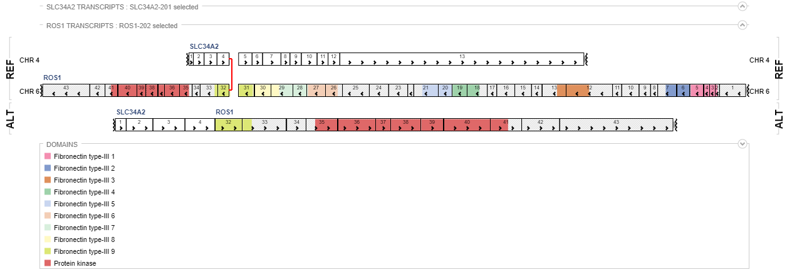

A user can change automatic transcript for both interacting genes. This is made by expanding a list of transcripts for a specific gene (click `arrow-up` next to gene name) and select a radio-button next to desired entry

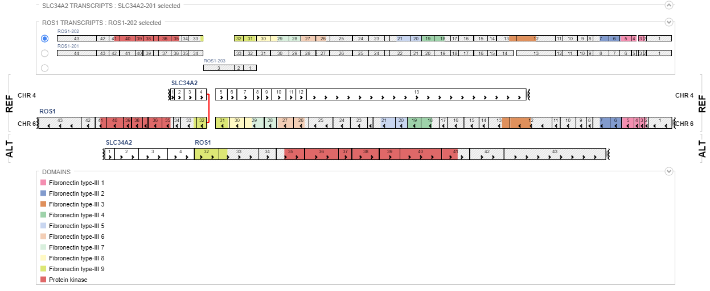

## SV visualizer domain-exon fix

A bug, which caused invalid mapping of domains to exons for genes located on the reverse strand, is fixed.

Reverse strand genes are handled correctly now.

# Genome annotations

## Genome menu GUI

`Genome` menu is added to the header of the `Browser` tab

This menu displays currently loaded genome and allows to show/hide linked annotation files (genes, protein domains, etc.)

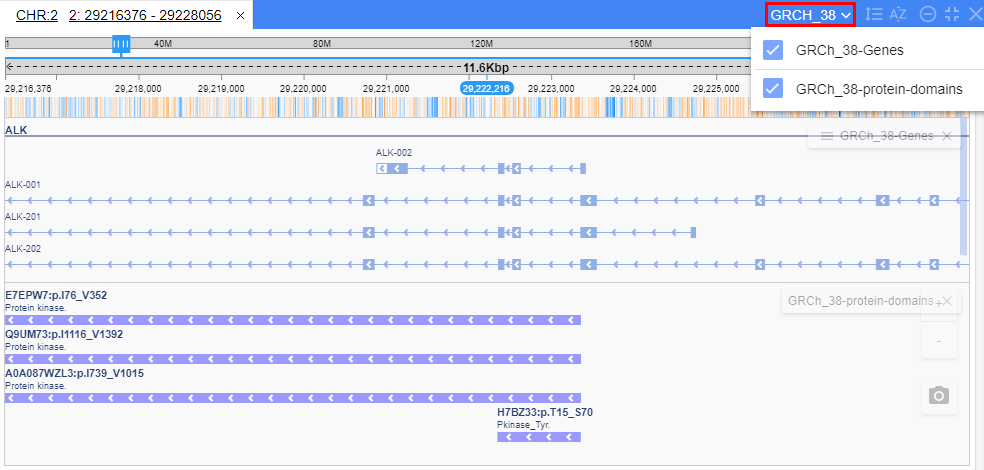

*Note: Genes file, which was previously available from a `Datasets` tree, now is avaialable from a `Genome menu`*

## Managing annotations with NGB CLI

`ngb-cli` now contains [add_ann](../../cli/command-reference.md) and [remove_ann](../../cli/command-reference.md) commands that allow linking annotation files to a specific genome (reference), thus making them visible via `Genome menu`

# "Organize tracks" menu

Now it is possible to manage tracks layout via `Organize tracks` menu added to the `Browser` tab header


This menu shows a list of currently opened tracks and provides the following features:
* Rearrange display order
    * `UP` and `DOWN` buttons move selected tracks by one position in a selected direction
    * `TO TOP` and `TO BOTTOM` move selected tracks to the beginning or to the end of the list
    * `SORT BY NAME ` and `SORT BY TYPE` will arrange tracks according to their names or files types in ascending order
    * `Drag and Drop` operation using a mouse is also available for the selected list to arrange custom sort order
    * Multiple selection is available via `Ctrl` or `Shift` keys
        * `Ctrl + LMB` selects tracks one by one
        * `Shift + LMB` selects a range of tracks

* Close selected tracks using `CLOSE` button
* Apply changes using `SAVE` button
* Discard changes using `CANCEL` button

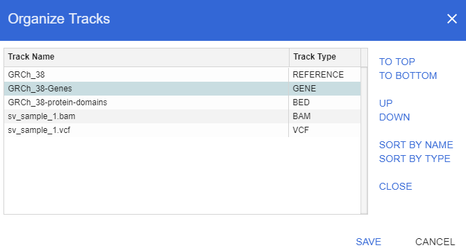

# Fit to screen

A "fit to screen" button is added to the `Browser` tab header


Clicking this button fits all the data tracks to the vertical space of one screen.
No matter how many tracks are opened, each of them will get an even part of the vertical space.

*Note: each track type has a minimal heght setting; if there is too little vertical space limitation on min-height, so in some cases - verticall scrolling will still occur*

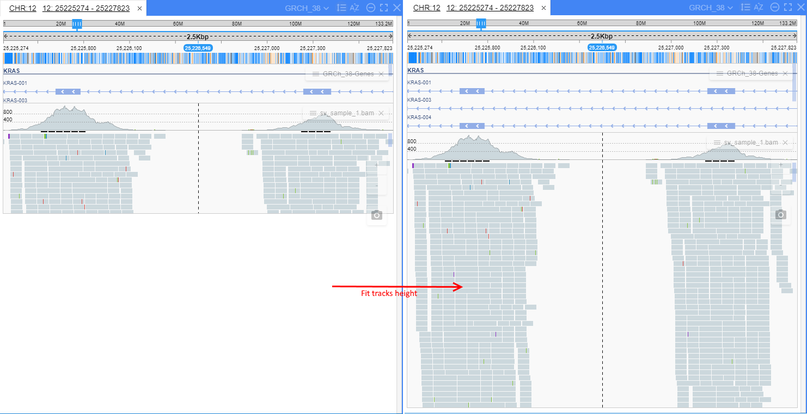

# Pretty names for files

In some cases NGS files' names are too long (e.g. `sample-name.processing-phase.index-seq.bam`). To make it more comfortable for user, "pretty" names are added to the tracks definition. 

Now it is possible to specify a "pretty" name for a track at registration time.

These names may be not unique, and can be used to provide a more user-friendly layout of a `Datasets` tree.

To specify "pretty" name, `--pretty` (`-pt`) option is added to `reg_file` command of `ngb-cli`:

```bash
$ ngb reg_file GRCh38 sample-name.processing-phase.index-seq.bam --pretty sample-name.bam
```

# "Not registered" files list

When opening files without registration via `Open from...` menu, they will be listed in a `Datasets` panel under `Not registered` group. 

`Not registered` group contains tracks that were opened without registration, thus allowing to quickly access recent files.

State of this group is persisted until a web-browser page is refreshed (e.g. `F5` is pressed)

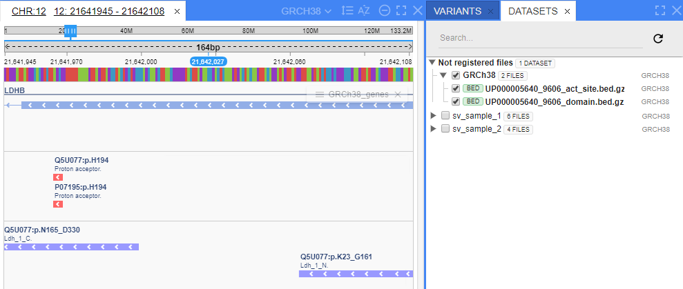

# Other

## Usability improvements

### Highlight on hover

* Features on tracks are now highlighted when hovering with a mouse

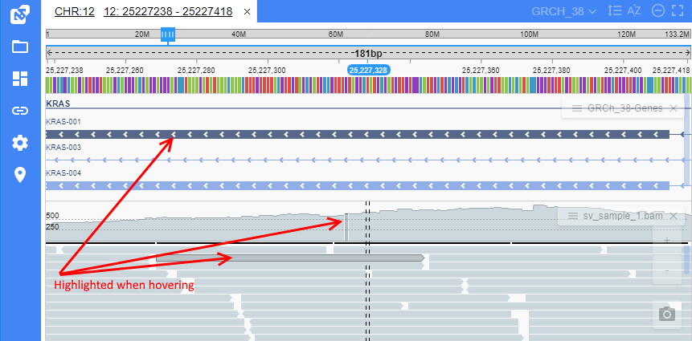

* This can be turned off via NGB global settings

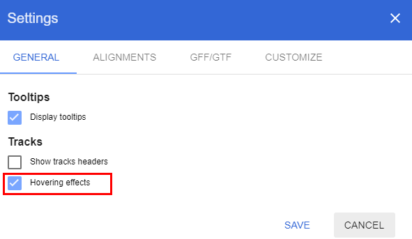

### Navigating to a BAM region with a "probable coverage"

* Clicking region in a BAM track with a "Probable coverage" will zoom in to that region coordinates

View "probable coverage"

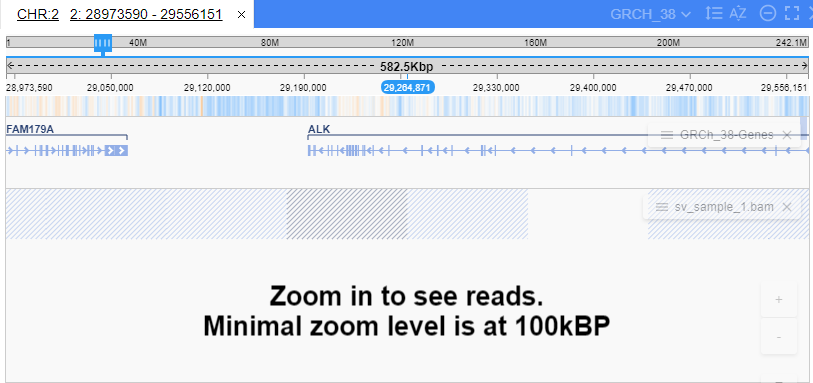

Clcik and zoom in to alignments

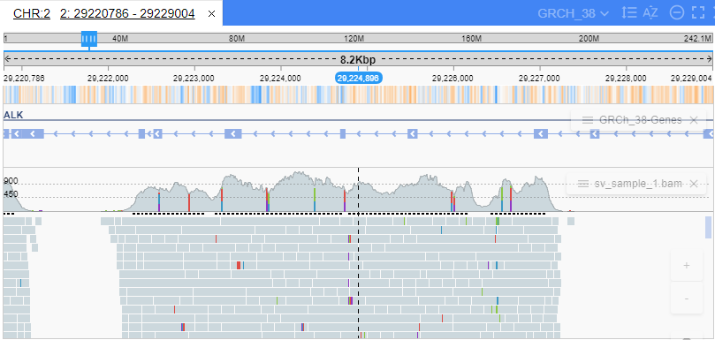

### Synchronous group operations for BAMs

If several BAMs contain different setting for "General -> Show alignments" - ALT+W hotkey sets all BAMs to NOT showing alignments

### CLI version info

`$ ngb version` command is added to `ngb-cli`, which outputs current NGB version

```bash
$ ngb version
2.5.0
```

## Performance improvements

### Alignments streaming

BAM alignments loading is performed in a streaming manner now.

* **Previously** NGB server has read all requested data from a BAM file, converted to a shortened format and transmitted back to a client

* **Now** NGB server process requested data by chunks

This approach provides:
* Processing datasets of any size without running into `OutOfMemory` issues
* Increasing overall BAM viewing performance 

### Tracks resizing

**Previously** when tracks height was resized - track data was rendered for each mouse-mouve event. For large datasets (e.g. regions with thousands of variations) this lead to a poor client perforance

**Now** when tracks are rendered only on mouse-button-up event, thus allowinf to render any amount of data without performance downgrade

## Compatibility improvements

NGB Client now tries to detect whether a web-browser is supported, if not - an alert is shown

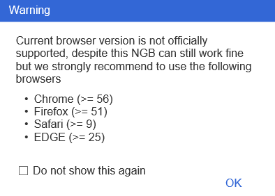

Tick "Do not show this again" checkbox to silent such notifications 


